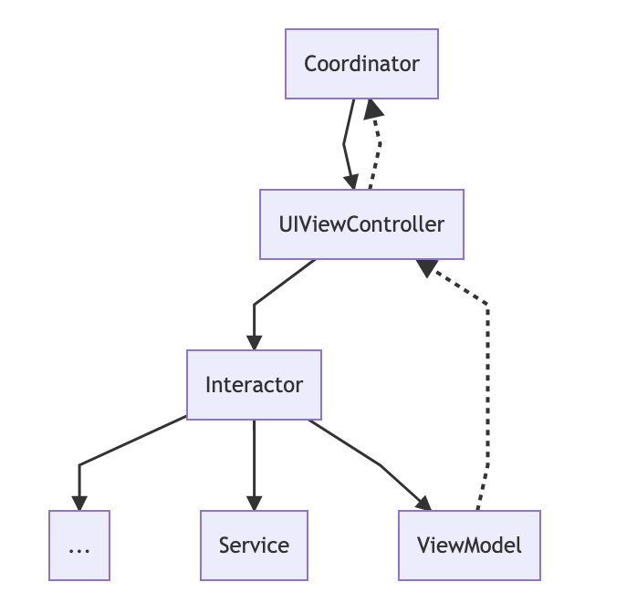

# WeatherApp

Sample application display wheater details by city, support online and offline mode.

## Requirement

Xcode 11 / iOS11 / Swift 5.0

## Project setup

Clone project
```
git clone https://github.com/cmoissam/WeatherApp
```

Run and Go !

## Documentation

### Embdedded Frameworks

[WeatherKit](https://github.com/cmoissam/WeatherApp/tree/master/WeatherKit)

### Architecture

This Application use a "MVVM + interactor + coordinator" architecture.

#### OverView



#### Components

##### UIViewController

Representation of a view.
Must not contains business logic which should be delegated to Interactor, same for navigation
which should be delegated to Coordinator.

##### Interactor

Interactor contains application business logic and provide a view model for his target view controller
to update his UI.

##### ViewModel

ViewModel are responsible for UI state representation and formatting logic.
Each ViewController UI update should be triggered by a ViewModel, use **Observable** type to listen to view model propery change.

##### Coordinator

Coordinators are the components in charge of navigation.

When creating root view controller in coordinator make sure to pass a strong reference with coordinator to keep it alive. 

##### Dependencies

For dependencies we use a simple class **SharedAppDependencies** all viewcontroller *must* be created there to don't pollute application code with dependencies configuration.

For the usage only one instance of AppDependencies must be used during application lifetime, so all coordinator should have one reference of it to handle his view controller construction.

We use an abstraction with *SharedRootContainer* protocol to have total control over depencies for unit testing.

## Give feedback

email: issam.lanouari@gmail.com

## Authors

**Lanouari Issam** - *Cmoissam*
