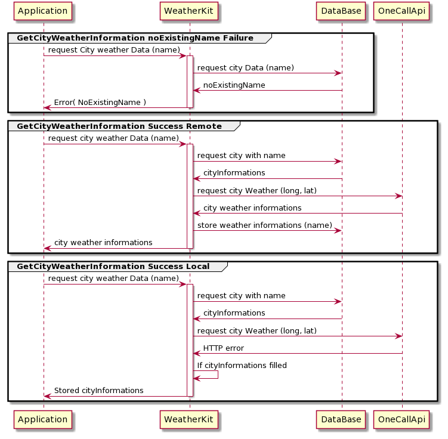

# WheaterKit

* Framework providing services for weather informations collect & Database storage.
* Data is collected from  Api: [https://api.openweathermap.org/data/2.5/onecall]

## Requirement

Xcode 11 / iOS11 / Swift 5.0

## Documentation
### Sequence Diagram

Presentation of 3 case for a service call :

### Provided Services:
#### Calls:
##### CreateNewCity: Store new city on database

    /// createNewCity: create new City on DataBase
    /// - Parameter name: name of city to create
    /// - Parameter longitude: longitude coordinate of city to create
    /// - Parameter latitude: latitude coordinate of city to create
    /// - Parameter completion: The completion block that is executed when the service finishes.
    ///
    public func createNewCity(
        name: String,
        longitude: Double,
        latitude: Double,
        completion: @escaping (CreateNewCityResult) -> Void
    ) { }

##### getCityWeatherInformations: Get Weather information for a give city Name

    /// getCityWeatherInformations: get weather inbformations of city
    /// Parameters :
    /// - Parameter name: name of requested city infoirlmation
    /// - Parameter completion: The completion block that is executed when the service finishes.
    ///
    public func getCityWeatherInformations(
        name: String,
        completion: @escaping (getCityWeatherInformationsResult) -> Void
    ) { }

##### CreateNewCity: Get Weather information for a give city Name
    
    /// getAllCities: get all  cities stored in DataBase
    /// - Parameter completion: The completion block that is executed when the service finishes.
    ///
    public func getAllCities(
        completion: @escaping (getAllCitiesResult) -> Void
    ) { }
    
#### Result & Errors:

#####  CreateNewCityResult:

    /// Result of createNewCity service call
    public enum CreateNewCityResult {
        case failure(_ error: WeatherInfoServiceError)
        case success
    }

#####  getCityWeatherInformationsResult:

    /// Result of getCityWeatherInformations service call
    public enum getCityWeatherInformationsResult {
        case failure(_ error: WeatherInfoServiceError)
        /// Data is not synchronised with Api
        case local(_ city: City)
        /// Data is  synchronised with Api
        case remote(_ city: City)
    }

#####  getAllCitiesResult:

    /// Result of getAllCities service call
    public enum getAllCitiesResult {
        case failure(_ error: WeatherInfoServiceError)
        case success(_ cities: [City])
    }

#####  WeatherInfoServiceError:

    /// Enum containing errors for one call service
    public enum WeatherInfoServiceError: Error {
        /// Error for duplicated name constraint on creation
        case duplicatedName
        /// Error for no data retrieved
        case noData
        /// Error for inexisting name in DataBase
        case inexistingName
    }

### Components:

##### NetworkManager

Manage the processing of UrlSessionTask and provide a simple way to send HTTP request and Parse HTTPResponse and HTTPErrors.

##### CityApi

User *NetworkManager* and provide a configuration, to get Api weather infromations for a given coordinates.

##### WeatherDataManager

Provide the persistence container of DataBase Model.

##### CityDataManger

Contain all methods to store & get the cities informations from DataBase use *WeatherDataManager*.

##### WeatherInfoService

Use *CityDataManger* & *CityApi* and add some logics to provide the services used from outside the Framework.

## Give feedback

email: issam.lanouari@gmail.com

## Authors

**Lanouari Issam** - *Cmoissam*
